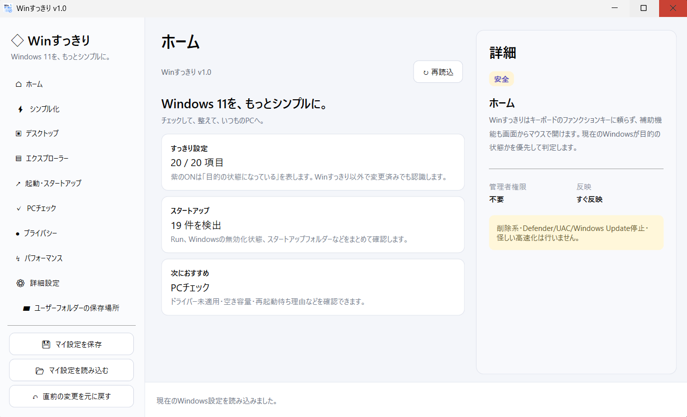
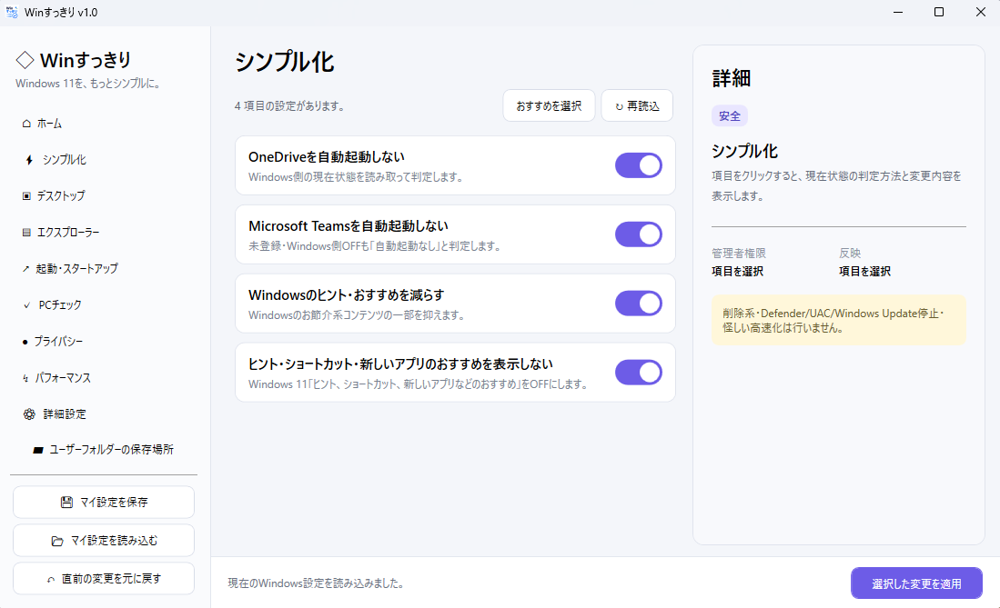
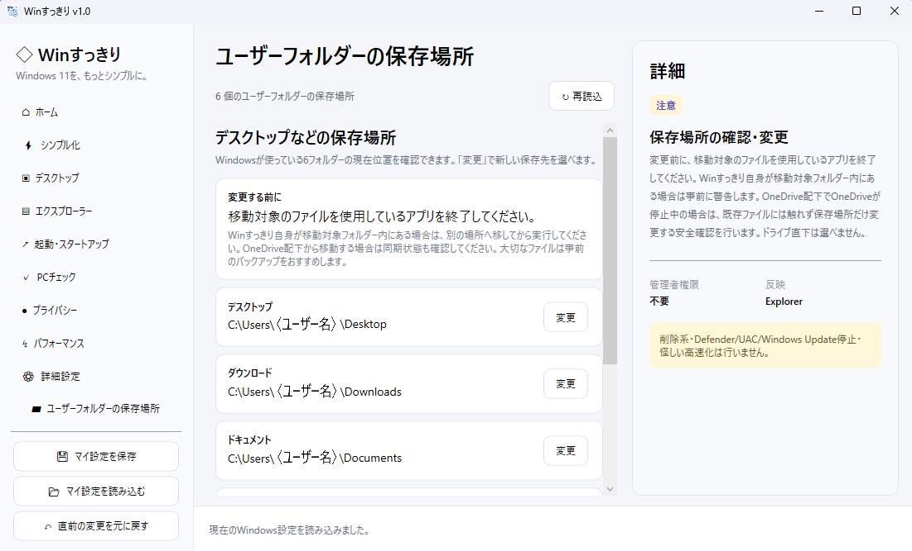

# Winすっきり

**Windows 11を、もっとシンプルに。**

Winすっきりは、Windows 11の初期設定や日常的な設定変更を、ひとつの画面から分かりやすく行うためのWindows用ユーティリティです。

不要ファイルを自動削除するクリーナーや、無理な「高速化」を行うソフトではありません。  
Windowsで普段手作業している設定を、現在の状態を確認しながら整理・変更することを目的にしています。

## 主な機能

- Windowsのヒント・おすすめ等の表示設定
- OneDrive / Microsoft Teamsなどの自動起動設定
- スタートアップ項目の確認・切り替え
- デスクトップ / エクスプローラー関連の設定
- PCチェック
- プライバシー関連の設定
- パフォーマンス関連の設定
- 詳細設定
- ユーザーフォルダーの保存場所変更
- マイ設定の保存・読み込み
- 直前の変更を元に戻す

## シンプル化

OneDriveやMicrosoft Teamsの自動起動、Windowsのヒント・おすすめなどをまとめて確認できます。

## ユーザーフォルダーの保存場所

デスクトップ、ダウンロード、ドキュメント、ピクチャ、ミュージック、ビデオの現在の保存場所を確認し、変更できます。

Winすっきり自身が移動対象フォルダー内から起動されている場合は、自分自身を巻き込んで移動しないよう安全のため処理を停止します。

## 対応OS

- Windows 11
- 64bit

## ダウンロード

最新版は、このリポジトリの **Releases** からダウンロードしてください。

## 使い方

1. ReleaseからZIPファイルをダウンロードします。
2. ZIPを任意の場所へ展開します。
3. `WinSukkiri.exe` をダブルクリックして起動します。
4. 変更したい項目を選び、内容を確認して適用します。

設定によっては、サインアウトや再起動後に完全に反映される場合があります。

## 注意

WinすっきりはWindowsの各種設定やレジストリ等を変更します。重要なデータは事前にバックアップすることをおすすめします。

会社や学校など管理されたPCでは、管理者の設定やポリシーにより変更できない項目があります。また、Windows Update等により将来一部の機能が利用できなくなる場合があります。

ユーザーフォルダーの保存場所を変更するときは、対象フォルダー内のファイルを使用しているアプリを終了してください。OneDrive配下から移動する場合は同期状態も確認してください。

自動ログインは利便性が上がる一方、PCを操作できる人がそのままアカウントへアクセスできる状態になります。共有PCや持ち運ぶPCでの利用には注意してください。

## バージョン

**Winすっきり v1.0**

## 作者

**morhirc**
